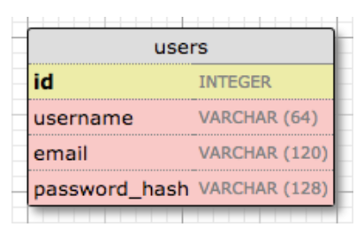
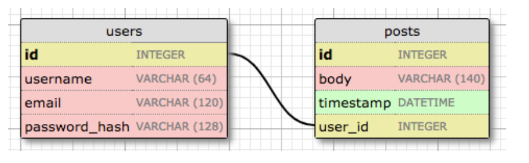

## Databases in Flask

Flask doesn’t include built-in database support, so Miguel introduces Flask-SQLAlchemy—a wrapper around SQLAlchemy that integrates smoothly with Flask and lets you define tables using Python classes.

```python
(venv) $ pip install flask-sqlalchemy
```

---

## Database Migrations

Miguel uses Flask-Migrate to handle schema changes over time. It wraps Alembic and integrates with Flask-SQLAlchemy for version-controlled migrations.

```python
(venv) $ pip install flask-migrate
```

---

## Flask-SQLAlchemy Configuration

Configuration is added to `config.py`, and initialization happens in `app/__init__.py`. This sets up the database and migration engine.


```python
# config.py: Flask-SQLAlchemy configuration

import os
basedir = os.path.abspath(os.path.dirname(__file__))

class Config:
    # ...
    SQLALCHEMY_DATABASE_URI = os.environ.get('DATABASE_URL') or \
        'sqlite:///' + os.path.join(basedir, 'app.db')
```

```python
# app/__init__.py: Flask-SQLAlchemy and Flask-Migrate initialization

from flask import Flask
from config import Config
from flask_sqlalchemy import SQLAlchemy
from flask_migrate import Migrate

app = Flask(__name__)
app.config.from_object(Config)
db = SQLAlchemy(app)
migrate = Migrate(app, db)

from app import routes, models
```

---

## Database Models

Miguel defines a `User` model using SQLAlchemy’s ORM. Each field is typed and indexed where appropriate. Passwords are stored as hashes.

### The Users Table
<!--img src="../images/users-table.png" width="200" height="100"-->



```python
#app/models.py: User database model

from typing import Optional
import sqlalchemy as sa
import sqlalchemy.orm as so
from app import db

class User(db.Model):
    id: so.Mapped[int] = so.mapped_column(primary_key=True)
    username: so.Mapped[str] = so.mapped_column(sa.String(64), index=True,
                                                unique=True)
    email: so.Mapped[str] = so.mapped_column(sa.String(120), index=True,
                                             unique=True)
    password_hash: so.Mapped[Optional[str]] = so.mapped_column(sa.String(256))

    def __repr__(self):
        return '<User {}>'.format(self.username)

```

```python
# See the __repr__() for the User class in action: 

>>> from app.models import User
>>> u = User(username='susan', email='susan@example.com')
>>> u
<User susan>
```

## Creating The Migration Repository

Miguel initializes the migration repository using Flask-Migrate. This sets up the `migrations/` directory.

```python
# Create the migration repository (no need to edit the logging settings)

(venv) $ flask db init
  Creating directory /home/miguel/microblog/migrations ... done
  Creating directory /home/miguel/microblog/migrations/versions ... done
  Generating /home/miguel/microblog/migrations/alembic.ini ... done
  Generating /home/miguel/microblog/migrations/env.py ... done
  Generating /home/miguel/microblog/migrations/README ... done
  Generating /home/miguel/microblog/migrations/script.py.mako ... done
  Please edit configuration/connection/logging settings in
  '/home/miguel/microblog/migrations/alembic.ini' before proceeding.
```

---

## The First Database Migration

Miguel generates the initial migration script and applies it to create the database.

```python
(venv) $ flask db migrate -m "users table"
INFO  [alembic.runtime.migration] Context impl SQLiteImpl.
INFO  [alembic.runtime.migration] Will assume non-transactional DDL.
INFO  [alembic.autogenerate.compare] Detected added table 'user'
INFO  [alembic.autogenerate.compare] Detected added index 'ix_user_email' on '['email']'
INFO  [alembic.autogenerate.compare] Detected added index 'ix_user_username' on '['username']'
  Generating /home/miguel/microblog/migrations/versions/e517276bb1c2_users_table.py ... done
```

```python
(venv) $ flask db upgrade
INFO  [alembic.runtime.migration] Context impl SQLiteImpl.
INFO  [alembic.runtime.migration] Will assume non-transactional DDL.
INFO  [alembic.runtime.migration] Running upgrade  -> e517276bb1c2, users table
```

---

## Database Upgrade and Downgrade Workflow

Miguel shows how to apply future changes and revert them if needed.


- **Why Migrations Matter**: As your app evolves, you'll need to update the database schema (e.g. adding tables or columns). Doing this manually on both development and production environments is error-prone and time-consuming.

- **Using Flask-Migrate & Alembic**:
  - After changing your models, run `flask db migrate` to generate a migration script.
  - Review the script to ensure it correctly reflects your changes.
  - Apply it to your development database using `flask db upgrade`.
  - Commit the migration script to source control.

- **Deploying to Production**:
  - When releasing a new version, include the migration script.
  - On the production server, run `flask db upgrade`.
  - Alembic will detect which migrations haven’t been applied and run them in order.

- **During Development**:
  - If a migration isn’t quite right, you can undo it with `flask db downgrade`.
  - Then delete or fix the migration script and regenerate it.

---

## Database Relationships

Miguel adds a `Post` model and links it to `User` via a foreign key. This models a one-to-many relationship.

### Schema for the new posts table



```python
# app/models.py: Posts database table and relationship

from datetime import datetime, timezone
from typing import Optional
import sqlalchemy as sa
import sqlalchemy.orm as so
from app import db

class User(db.Model):
    id: so.Mapped[int] = so.mapped_column(primary_key=True)
    username: so.Mapped[str] = so.mapped_column(sa.String(64), index=True,
                                                unique=True)
    email: so.Mapped[str] = so.mapped_column(sa.String(120), index=True,
                                             unique=True)
    password_hash: so.Mapped[Optional[str]] = so.mapped_column(sa.String(256))

    posts: so.WriteOnlyMapped['Post'] = so.relationship(
        back_populates='author')

    def __repr__(self):
        return '<User {}>'.format(self.username)

class Post(db.Model):
    id: so.Mapped[int] = so.mapped_column(primary_key=True)
    body: so.Mapped[str] = so.mapped_column(sa.String(140))
    timestamp: so.Mapped[datetime] = so.mapped_column(
        index=True, default=lambda: datetime.now(timezone.utc))
    user_id: so.Mapped[int] = so.mapped_column(sa.ForeignKey(User.id),
                                               index=True)

    author: so.Mapped[User] = so.relationship(back_populates='posts')

    def __repr__(self):
        return '<Post {}>'.format(self.body)
```

## Line-by-Line Breakdown of the `Post` Class

```python
class Post(db.Model):
    id: Mapped[int] = mapped_column(primary_key=True)
    body: Mapped[str] = mapped_column(Text)
    timestamp: Mapped[datetime] = mapped_column(index=True, default=lambda: datetime.utcnow())
    user_id: Mapped[int] = mapped_column(ForeignKey("user.id"), index=True)
    author: Mapped["User"] = relationship(back_populates="posts")
```

Let’s unpack each part:

---

###  `lambda: datetime.utcnow()`
- A **lambda function** is a tiny, anonymous function. Think of it like a shortcut.
- `lambda: datetime.utcnow()` means: “When a new post is created, automatically set the timestamp to the current UTC time.”
- Why UTC? Because it’s a universal time standard—great for apps with users in different time zones.

---

###  `Mapped[...]` and `mapped_column(...)`
- `Mapped[int]` or `Mapped[str]` tells SQLAlchemy: “This field maps to a database column and has this type.”
- `mapped_column(...)` is how you define the column’s behavior—like whether it’s a primary key, indexed, or has a default value.
- Example:
  ```python
  id: Mapped[int] = mapped_column(primary_key=True)
  ```
  This means: “This is an integer column, and it’s the primary key.”

---

###  `Optional[str]`
- This comes from Python’s typing system.
- `Optional[str]` means the value can be a string **or** `None` (i.e. it’s allowed to be empty).
- SQLAlchemy uses this to decide whether the column should be `nullable=True`.

---

###  `WriteOnlyMapped[List["Post"]]`
- This is used for **relationships**, not actual columns.
- `WriteOnlyMapped` means: “This is a one-to-many relationship, but we don’t want to automatically load all related items unless we ask for them.”
- It’s a performance optimization—especially useful when a user might have hundreds of posts.

---

###  `relationship(...)` and `back_populates`
- `relationship("User", back_populates="posts")` sets up a link between `Post` and `User`.
- `back_populates="posts"` tells SQLAlchemy: “This field connects to the `posts` field on the `User` class.”
- It creates a two-way connection:
  - From a post, you can access its author: `post.author`
  - From a user, you can access their posts: `user.posts`

---

##  TL;DR Summary
| Concept              | What It Means                                                                 |
|----------------------|--------------------------------------------------------------------------------|
| `lambda`             | A mini function used to set default values (like current time)                |
| `Mapped[...]`        | Declares a field that maps to a database column                               |
| `mapped_column(...)` | Defines column properties (type, index, default, etc.)                        |
| `Optional[str]`      | Field can be a string or `None` (nullable)                                    |
| `WriteOnlyMapped`    | Relationship that doesn’t auto-load data unless requested                     |
| `relationship(...)`  | Links two models together (e.g. Post ↔ User)                                  |
| `back_populates`     | Tells SQLAlchemy how the two sides of a relationship connect                  |

---

```python
# A migration command for the new posts table:
(venv) $ flask db migrate -m "posts table"
INFO  [alembic.runtime.migration] Context impl SQLiteImpl.
INFO  [alembic.runtime.migration] Will assume non-transactional DDL.
INFO  [alembic.autogenerate.compare] Detected added table 'post'
INFO  [alembic.autogenerate.compare] Detected added index 'ix_post_timestamp' on
'['timestamp']'
  Generating /home/miguel/microblog/migrations/versions/780739b227a7_posts_table.py ... done
```
```python
# Apply the migration command to the database
(venv) $ flask db upgrade
INFO  [alembic.runtime.migration] Context impl SQLiteImpl.
INFO  [alembic.runtime.migration] Will assume non-transactional DDL.
INFO  [alembic.runtime.migration] Running upgrade e517276bb1c2 -> 780739b227a7, posts table
```
---

## Playing with the Database

Miguel demonstrates how to interact with the database using the Flask shell. 

```python
# Import the application, database instance, models and SQLAlchemy entry point:

>>> from app import app, db
>>> from app.models import User, Post
>>> import sqlalchemy as sa
>>> app.app_context().push()
```

```python
# Next, create a new user:

>>> u = User(username='john', email='john@example.com')
>>> db.session.add(u)
>>> db.session.commit()
```

```python
# Let's add another user:

>>> u = User(username='susan', email='susan@example.com')
>>> db.session.add(u)
>>> db.session.commit()
```

```python
# The database can answer a query that returns all the users:

>>> query = sa.select(User)
>>> users = db.session.scalars(query).all()
>>> users
[<User john>, <User susan>]
```

```python
# Sometimes it's more convenient to loop through the users:

>>> users = db.session.scalars(query)
>>> for u in users:
>>> print(u.id, u.username)

1 john
2 susan
```

```python
# You can get a user by the user id

>>> u = db.session.get(User, 1)
>>> u
<User john>
```

```python
# Add a blog post using the user id
>>> u = db.session.get(User, 1)
>>> p = Post(body='my first post!', author=u)
>>> db.session.add(p)
>>> db.session.commit()
```

```python
# More examples of database queries

# get all posts written by a user
>>> u = db.session.get(User, 1)
>>> u
<User john>
>>> query = u.posts.select()
>>> posts = db.session.scalars(query).all()
>>> posts
[<Post my first post!>]

# same, but with a user that has no posts
>>> u = db.session.get(User, 2)
>>> u
<User susan>
>>> query = u.posts.select()
>>> posts = db.session.scalars(query).all()
>>> posts
[]

# print post author and body for all posts
>>> query = sa.select(Post)
>>> posts = db.session.scalars(query)
>>> for p in posts:
...     print(p.id, p.author.username, p.body)
...
1 john my first post!

# get all users in reverse alphabetical order
>>> query = sa.select(User).order_by(User.username.desc())
>>> db.session.scalars(query).all()
[<User susan>, <User john>]

# get all users that have usernames starting with "s"
>>> query = sa.select(User).where(User.username.like('s%'))
>>> db.session.scalars(query).all()
[<User susan>]
```

## Downgrade and upgrade
```bash
#You can exit the Python shell and erase the test users and posts we just created so the database is clean and ready for the next chapter

(venv) $ flask db downgrade base
(venv) $ flask db upgrade
```
## Shell Context

Miguel configures a shell context so that `db`, `User`, and `Post` are auto-imported when using `flask shell`.

```python
# You can configure the shell so that you don't have to push the context each time you enter the shell
(venv) $ python
>>> app
Traceback (most recent call last):
  File "<stdin>", line 1, in <module>
NameError: name 'app' is not defined
>>> exit()

# After configuring the shell

(venv) $ flask shell
>>> app
<Flask 'app'>
```
### Configuring the shell inside microblog.py
```python
import sqlalchemy as sa
import sqlalchemy.orm as so
from app import app, db
from app.models import User, Post

@app.shell_context_processor
def make_shell_context():
    return {'sa': sa, 'so': so, 'db': db, 'User': User, 'Post': Post}
```

```python
# Now you have access to the applocation variables without having to push the context
(venv) $ flask shell
>>> db
<SQLAlchemy sqlite:////home/miguel/microblog/app.db>
>>> User
<class 'app.models.User'>
>>> Post
<class 'app.models.Post'>
```
## Sample CRUD operations with SQLAlchemy ORM based on the User and Post tables
---
```Python
reference for CRUD operations (Create, Read, Update, Delete) and looping through users and posts using SQLAlchemy in a Flask-style application, just like Miguel Grinberg’s tutorial.

---

##  Model Setup

```python
class User(db.Model):
	id = db.Column(db.Integer, primary_key=True)
	username = db.Column(db.String(64), unique=True, index=True)
	posts = db.relationship('Post', back_populates='author')

class Post(db.Model):
	id = db.Column(db.Integer, primary_key=True)
	body = db.Column(db.Text)
	timestamp = db.Column(db.DateTime, index=True, default=datetime.utcnow)
	user_id = db.Column(db.Integer, db.ForeignKey('user.id'))
	author = db.relationship('User', back_populates='posts')
```

---

##  CRUD Operations based on the User and the Post tables

###  Create

```python
# Create a new user
new_user = User(username="alice")
db.session.add(new_user)
db.session.commit()

# Create a new post for that user
new_post = Post(body="Hello world!", author=new_user)
db.session.add(new_post)
db.session.commit()
```

###  Read

```python
# Get a user by username
user = User.query.filter_by(username="alice").first()

# Get all posts by that user
user_posts = user.posts  # thanks to the relationship

# Get all users
all_users = User.query.all()

# Get all posts
all_posts = Post.query.order_by(Post.timestamp.desc()).all()
```

###  Update

```python
# Update a user's username
user.username = "alice_updated"
db.session.commit()

# Update a post's content
post = Post.query.first()
post.body = "Updated content"
db.session.commit()
```

###  Delete

```python
# Delete a post
post_to_delete = Post.query.first()
db.session.delete(post_to_delete)
db.session.commit()

# Delete a user (and optionally their posts)
user_to_delete = User.query.filter_by(username="alice_updated").first()
db.session.delete(user_to_delete)
db.session.commit()
```

---

##  Looping Through Users and Their Posts

```python
users = User.query.all()

for user in users:
	print(f"User: {user.username}")
	for post in user.posts:
		print(f"  - {post.body} (Posted at {post.timestamp})")
```

##  Looping Through Posts and Showing Authors

```python
posts = Post.query.order_by(Post.timestamp.desc()).all()

for post in posts:
	print(f"{post.author.username} wrote: {post.body}")
```